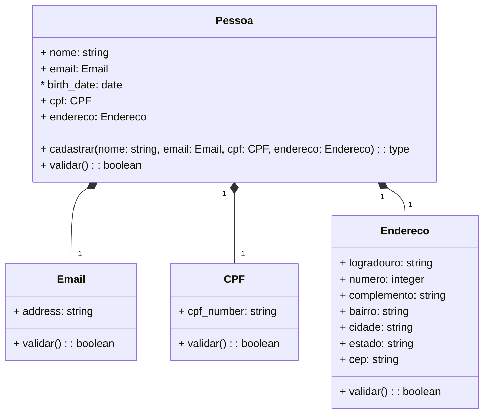

### API de Gerenciamento de Pessoas ✅

Uma RESTful API construída em Django Rest Framework, seguindo os princípios do SOLID.

## Principais Tecnologias
 - **Django**: Um poderoso framework web em Python que ajuda a criar aplicativos robustos e escaláveis.
 - **Docker**: Utilizando Docker Multi-Stage para otimização.
 - **Restframework (django)**: Uma poderosa e flexível toolkit para construir Web APIs.

## Diagrama de Classes (Domínio da API)

URL de da api: http://localhost:8000/v1/api/users/
